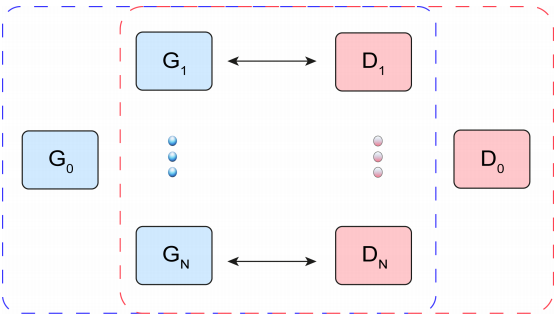
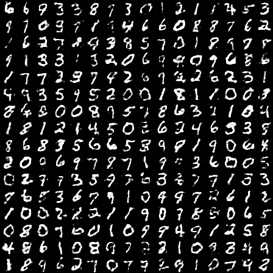
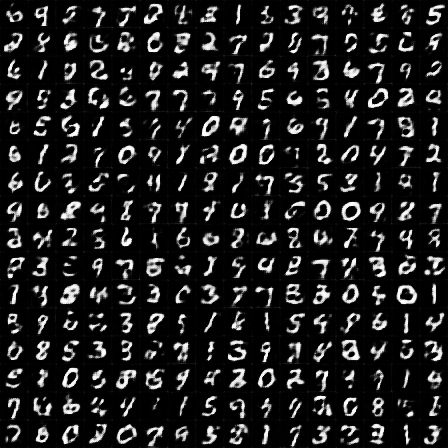
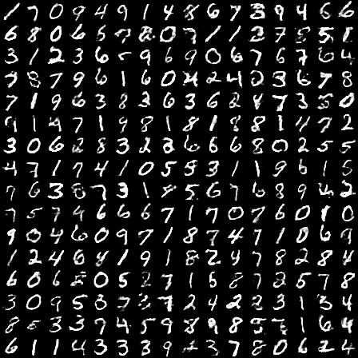
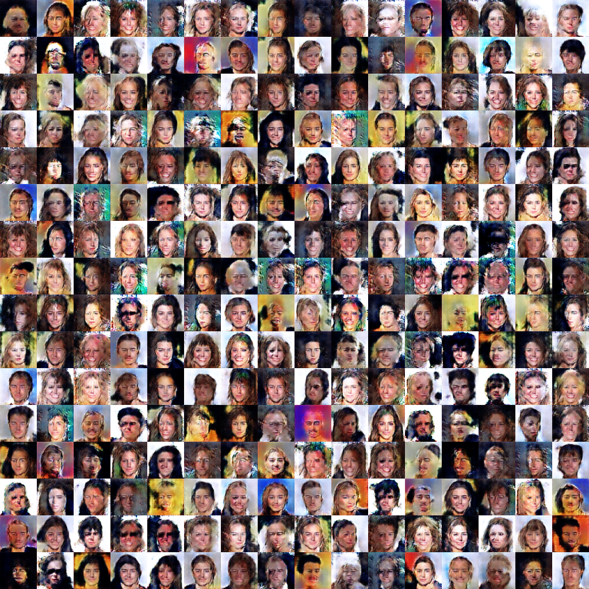
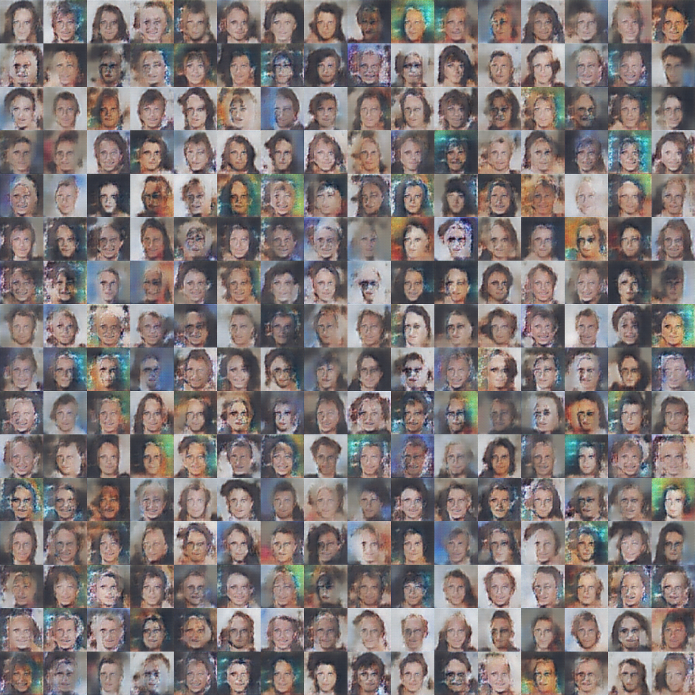
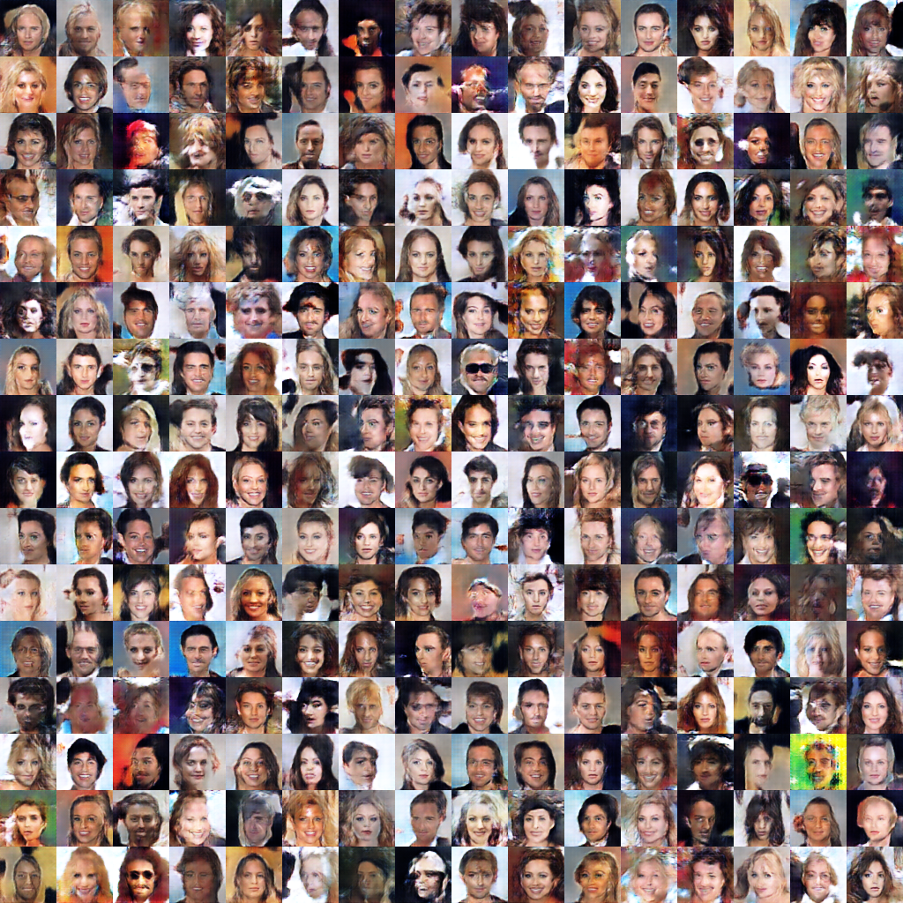
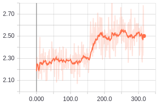

# SGAN: several GAN

Pytorch implementation of [SGAN: An Alternative Training of Generative Adversarial Networks](http://openaccess.thecvf.com/content_cvpr_2018/papers/Chavdarova_SGAN_An_Alternative_CVPR_2018_paper.pdf) where global Discriminator and Generator are trained using local pairs (GANs).

## Dependencies

- Python==2.7+
- scipy==1.1.0
- six==1.11.0
- tensorboardX==1.4
- tensorflow==1.4.1
- tensorflow-tensorboard==1.5.1
- torch==0.4.0
- torchvision==0.2.1
- easydict==1.9
- matplotlib==3.0.0
- numpy==1.15.4

## Usage

In config.py you can set up your own parameters:  
1. Dataset type.
2. Parameters values for training SGAN.
3. Folders/files name for saving training process/result.

I worked with MNIST and CelebA, for downloading these datasets you can use scripts from this [repo]().

In main.py training process is running.

## Results

#### MNIST

After 1st epoch (128 batch size):
 - Global pair: 

- Local pair #1: 

After 14th epoch: 
- Global pair: 

#### CelebA
After 1st epoch (128 batch size):
 - Global pair: 

- Local pair #5: 

After 2nd epoch: 
- Global pair: 

Inception Score on validation dataset for Global Pair:

## Training details

There is a possibility to use WGAN and WGAN with gradient penalty, 
but I could't succeed with it. If you see any error in code, please let me know! 
I achieved such results using DCGAN with vanilla loss function based on Kullback-Leibler Divergence.

## Related works

- [DCGAN-tensorflow](https://github.com/carpedm20/DCGAN-tensorflow)
- [Inception Score Pytorch](https://github.com/sbarratt/inception-score-pytorch)

## Author

Firiuza Shigapova / [@Firyuza](https://github.com/Firyuza) github / [@SirenaFiriuza](https://medium.com/@SirenaFiriuza) medium
